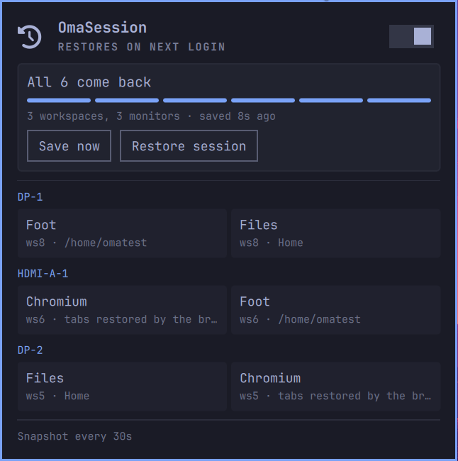

# OmaSession

**We Can Bring Every Window Back.**

Reopens what you had open, where you had it, after a reboot or a crash — the
thing macOS does with *"Reopen windows when logging back in"*, on Omarchy 4.


> **Status: usable end to end.** Save, restore, the guard, the resolver and
> the panel all read and write through the real CLI — no mock, no fabricated
> data. See [Where it actually is](#where-it-actually-is) for what is
> verified where.

| | |
|---|---|
| **Any application** | Resolves the command from the system itself — `.desktop` index, systemd scope, `/proc` — not a fixed list of known terminals and browsers. |
| **Grouped by monitor** | Windows are grouped under the monitor they were on, each with its own workspaces underneath — not one flat list. |
| **tmux-aware** | A terminal attached to tmux comes back attached to the *same session*, not a bare shell in `$HOME`. |
| **Honest about gaps** | A window with no known launch command is flagged before the reboot, in the panel — never discovered after. |
| **Browser tabs, for real** | Arms the browser's own crash-recovery instead of scripting individual tabs — survives power loss and GPU lockups a pre-shutdown hook never could. |
| **Never a worse save** | Every snapshot is staged, validated against the screen it came from, and only then published — a save that can't prove itself never overwrites one that could. |

## Why a new plugin

Tools that predate Omarchy 4 drive the compositor with the pre-Lua `hyprctl
dispatch exec` / `keyword windowrule` syntax. On a Lua-configured Hyprland
0.56 — the Omarchy 4 default — that syntax is rejected *silently*: the tool
reports success against an empty desktop.

| | hyprresume 0.5.0 | OmaSession |
|---|---|---|
| 6 mixed windows | 0/6 in 150s | **6/6 in 7s** |
| single-instance Chromium windows | does not launch | **4/4 in 3s** |
| after a real reboot | 0 restored | **4/4 in 5s**, plus the browser's own tabs |

Geometry, floating state and a terminal's working directory come back
identical.

## How it works

**Resolving what to relaunch.** `lib/resolve.py` answers "what command
brings this back?" from the system — the `.desktop` index, the systemd
scope for Flatpaks, `/proc/cmdline` as a last resort — instead of a fixed
app list. 19/19 resolved against a real desktop; a window it can't resolve
is flagged before the reboot, not discovered after. A terminal attached to
tmux reattaches to that exact session instead of coming back as a bare
shell. See [`docs/plans/003`](docs/plans/003-command-resolver.md) and
[`docs/plans/005`](docs/plans/005-tmux-session-recovery.md).

**Browser tabs.** Nothing is lost at shutdown — the session file survives
the reboot byte-for-byte. What blocks the restore is one line in the
browser's own profile, `exit_type = "Crashed"`, written when the session
teardown kills it. Arming that flag back to `"Normal"` needs no
pre-shutdown hook: **3/3 tabs restored** with it armed, 0/3 without, across
Chromium and Chrome. Full result and the six ruled-out hypotheses:
[`docs/plans/001`](docs/plans/001-RESULTADO.md).

**Multi-monitor.** "Workspace 3" means a different desk depending on which
screen it is on, so the panel groups windows under the monitor they were on
first. The list scrolls on its own inside whatever room is left on screen —
the promise and the buttons above it, and the save cadence below it, stay
fixed and reachable regardless of how much there is to list.



**Never a worse save.** A session saver's worst failure isn't missing a
save — it's overwriting a good one with a bad one. `lib/session-save.sh`
stages every save into its own generation, validates it against the screen
it was taken from, and only then publishes it. 25/25 in
`test/guard-cases.sh`, including killing the save mid-write at random.

## Install

The CLI lives inside the plugin's own directory — `omarchy plugin add`
clones it there but does not put it on `PATH`, so every command below
spells out where it is:

```
omarchy plugin add https://github.com/brenoperucchi/omasession --enable
~/.config/omarchy/plugins/brenoperucchi.omasession/bin/omasession install
```

`install` writes and enables the user-level snapshot timer (`systemctl
--user`, no root) and adds one marked login-restore line to
`~/.config/hypr/autostart.lua`. Nothing captures or restores anything
before this step runs. Depends on `python3`, `jq`, and `hyprctl` — all
present on a stock Omarchy install; `tmux` only if a terminal window is
already a tmux client.

**Chrome only, one-time, needs root** — a literal command, not a script:

```
printf '%s\n' '{"RestoreOnStartup": 1, "PromotionalTabsEnabled": false, "DefaultBrowserSettingEnabled": false}' \
  | sudo install -D -T -m 644 /dev/stdin /etc/opt/chrome/policies/managed/omasession-no-promo.json
```

Swap the destination for the browser you have — `/etc/chromium/policies/managed/…`,
`/etc/brave/policies/managed/…`, `/etc/vivaldi/policies/managed/…`, or
`/etc/opt/edge/policies/managed/…` — same filename, same content;
`omasession install`/`uninstall` check all five. `install -D -T -m 644`
creates the directory if it's missing and replaces the destination outright
at that exact name, the same way this project's own writes do — `-T` is
what keeps it from treating an existing directory (or a symlink to one) at
that name as a place to copy *into*, under a name of its own choosing,
instead of replacing it; without it, a symlink there defeats the write
silently rather than being refused. One narrower gap remains, and needs
root already to matter: a symlink swapped into an ancestor directory under
`/etc` (not the final name) is still followed — every component from
`/etc` down is normally root-owned 0755, so reaching that requires either
already having root or an already-broken package.

Chrome replaces session restore with onboarding pages on the first launch
after every version bump, silently dropping that restore — fixing it needs
a browser policy file, since Chrome ignores the same setting written by
hand. Opt-in, run by you, once; `omasession install` never writes it for
you, and nothing in this plugin ever runs as root. Chromium doesn't need
this.

## Usage

The panel (bar widget) shows what was last captured and whether it can come
back, with **Save now** and **Restore session**. Same from the CLI:

```
OMASESSION=~/.config/omarchy/plugins/brenoperucchi.omasession/bin/omasession
$OMASESSION save              # capture now, outside the timer's own cadence
$OMASESSION restore           # replay the last capture into the compositor
$OMASESSION status --json     # what the panel itself reads
$OMASESSION resolve           # which command each current window would resolve to
```

## Configure

Through the panel's settings, or directly with the same CLI:

```
OMASESSION=~/.config/omarchy/plugins/brenoperucchi.omasession/bin/omasession
$OMASESSION config set saveIntervalSec 30      # how often the timer snapshots
$OMASESSION config set restoreOnLogin true     # replay automatically at login
$OMASESSION config set browserRestore true     # let the browser reopen its own tabs
```

## Remove

**In this order** — the CLI lives inside the plugin's directory, so
uninstall first, or `omarchy plugin remove` deletes it out from under
itself, leaving the timer, the login-restore line, and any browser policy
still active with nothing left to clean them up:

```
OMASESSION=~/.config/omarchy/plugins/brenoperucchi.omasession/bin/omasession
$OMASESSION uninstall
sudo rm -f /etc/opt/chrome/policies/managed/omasession-no-promo.json   # only if you ran the browser policy command above
omarchy plugin remove brenoperucchi.omasession
```

`uninstall` disables the snapshot timer, removes only the login-restore
line it added, and prints the exact `sudo rm -f` for any browser policy
file it finds still present (it's machine-wide, so removing it is a
separate, explicit command — swap in whichever vendor path it reports).
Saved sessions under `~/.local/share/omasession/` are left alone.

## Where it actually is

| Piece | State |
|---|---|
| `lib/replay.py` — replay engine | **works**, validated across four real reboots |
| `lib/session-save.sh` — save + guard | **works**, 25/25 in `test/guard-cases.sh` |
| `lib/resolve.py` — arbitrary application resolver | **works**, 19/19 against a real desktop |
| `bin/browser-setup --list-paths` | **works** — unprivileged, used by install/uninstall to check |
| `bin/omasession` — CLI | **works**, exercised end to end in the lab |
| `systemd/` snapshot timer | **works**, written and enabled by `install` |
| `Panel.qml` — bar widget | **works**, reads `status --json` live |

## Docs

- [`docs/DESIGN.md`](docs/DESIGN.md) — what was measured, what it forced.
- [`docs/PANEL.md`](docs/PANEL.md) — the panel's states and the Omarchy
  shell traps that cost the most.
- [`docs/plans/`](docs/plans/) — every question, open and closed, with the
  measurement behind it.

Every number above is an observation from a QEMU guest running Omarchy
4.0.1 with Hyprland 0.56.2, not an estimate.

## License

MIT.
