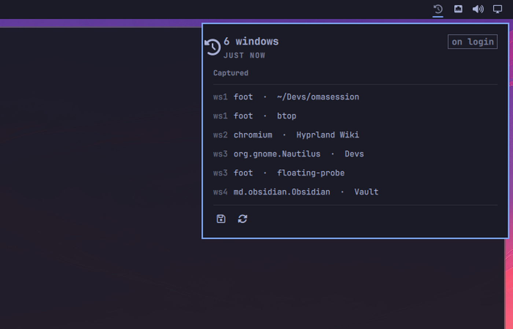

# OmaSession

**Reopens what you had open, where you had it, after a reboot or a crash.**

The thing macOS does with *"Reopen windows when logging back in"* — on
Omarchy 4.

> **Status: not usable yet.** The replay engine and the save guard are built and
> measured; the CLI, the systemd units and the panel's data source are not. The
> bar widget you see above renders **fabricated data** from a `mock` block, not
> your session — it is not yet wired to the CLI that now exists. From a terminal
> the save/restore/status path does work; see
> [Where it actually is](#where-it-actually-is).

## Why a new plugin

Every session-restore tool for Hyprland drives the compositor with the pre-Lua
`hyprctl dispatch exec` / `keyword windowrule` syntax. On a Lua-configured
Hyprland 0.56 — the Omarchy 4 default — that syntax is rejected, and rejected
*silently*: the tool reports success against an empty desktop.

Measured on a 6-window session, hyprresume 0.5.0 restores **0 of 6** in 150
seconds and prints `restore complete: 6/6 apps (0 failed)`.

| | hyprresume 0.5.0 | OmaSession |
|---|---|---|
| 6 mixed windows | 0/6 in 150s | **6/6 in 7s** |
| 3 single-instance Chromium windows | does not launch | **4/4 in 3s** |
| after a real reboot | 0/6 | **5/5 in 5s** |

Geometry, floating state and a terminal's working directory come back identical.
OmaSession speaks the API the compositor actually accepts —
`hl.dispatch(hl.dsp.*)`.

## Browser tabs come back too, and the reason is not what we assumed

The open question was why browser tabs never survived a reboot. The answer,
measured across two reboots with three URL sentinels per browser and the tabs
the browser *actually reopens* as the oracle:

**Nothing is lost at shutdown.** The session file crosses the reboot
byte-for-byte — same name, same size, all sentinels present in a copy taken
before any GUI or browser started. What blocks the restore is one line in the
profile: `profile.exit_type = "Crashed"`. The browser is killed by the session
teardown, marks the profile crashed, and refuses to auto-restore.

Same snapshot, Chromium 151 and Chrome 152: **3/3 with the profile armed, 0/3
without**. No pre-shutdown hook is needed — which also means it works for the
power loss and GPU lockups no hook could ever cover.

Full result and the six hypotheses it eliminated:
[`docs/plans/001-RESULTADO.md`](docs/plans/001-RESULTADO.md).

## Never trade a good session for a worse one

A session saver's worst failure is not missing a save — it is overwriting a good
session with a bad one. Both happened during development:

- hyprresume's daemon replaced a five-window `last.toml` with a one-window one
  and left it beside a five-window sidecar. Nothing was zero, and the session
  was ruined anyway.
- An earlier guard here printed `refusing to overwrite 3 saved windows with 0`,
  exited **0**, and destroyed the file regardless — because it ran *after* the
  write it was meant to prevent.

So `lib/session-save.sh` backs both files up, lets hyprresume write, validates
what came out against the screen it was taken from, and rolls **both** back if
the result is empty, smaller than the screen, or unparseable. It holds a lock so
the snapshot timer cannot race itself, and reports a distinct exit code when it
refuses. `test/guard-cases.sh` covers the cases (16 assertions, run against a
live Hyprland).

## Where it actually is

| Piece | State |
|---|---|
| `lib/replay.py` — the replay engine | **works**, validated across four real reboots |
| `lib/session-save.sh` — save + guard | **works**, 16/16 in `test/guard-cases.sh` |
| `bin/browser-setup` — per-vendor policy | **works** |
| Browser tab restore | **understood and measured**, not yet wired into the plugin |
| `bin/omasession` — CLI (save/restore/status/install/uninstall) | **works**, exercised end to end in the lab |
| `systemd/` snapshot timer | **works**, written and enabled by `omasession install` |
| `Panel.qml` — bar widget | **mockup**: renders real components, fabricated data. Not yet reading `status --json` |

## Docs

- [`docs/DESIGN.md`](docs/DESIGN.md) — what was measured, what it forced, and
  where the boundary with hyprresume sits.
- [`docs/PANEL.md`](docs/PANEL.md) — the panel's three states, and the Omarchy
  shell traps that cost the most (a bar widget with no `implicitWidth` renders
  nothing and reports nothing).
- [`docs/plans/`](docs/plans/) — open questions and closed ones.

Every number in these documents is an observation from a QEMU guest running
Omarchy 4.0.1 with Hyprland 0.56.2, not an estimate.

## License

MIT.
